**Comprehensive Linux Operations**

**Part 1: Creating and Editing Text Files**

**1. Using Nano**

Create a file  server\_config.txt using Nano#!/bin/bash

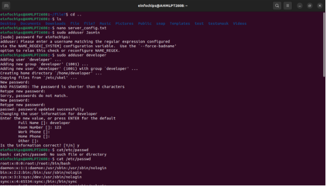

**Part 2: User & Group Management Add a new user  developer :**

sudo adduser developer

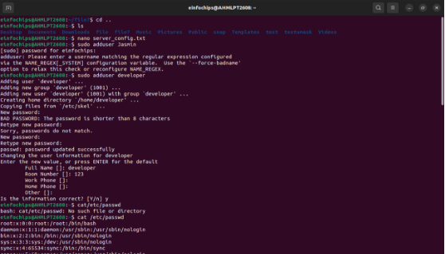

1. **Managing Groups**

**Create a group  devteam :** sudo groupadd devteam

**Add the user  developer to the  devteam group:** sudo usermod -aG devteam developer

**Remove the user  developer from the  devteam group:** sudo gpasswd -d developer devteam

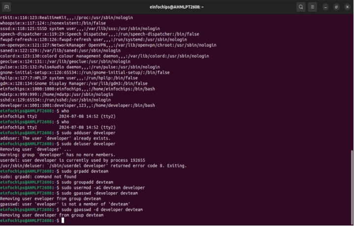

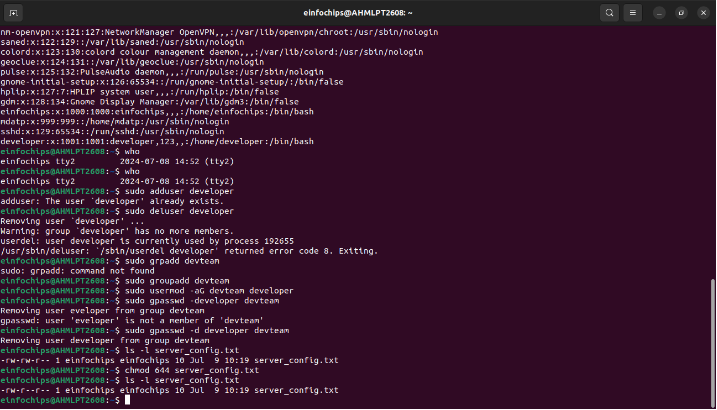

**Part 3: File Permissions Management**

**Understanding File Permissions**

View permissions for  server\_config.txt :

ls -l server\_config.txt

- Discuss the output (e.g.,  -rw-r--r-- ).
2. **Changing Permissions and Ownership**

Change permissions to read/write for the owner and read-only for others: chmod 644 server\_config.txt

Verify the change:

ls -l server\_config.txt

￿

Change the owner to  developer and the group to  devteam :

sudo chown developer:devteam server\_config.txt

Verify the change:

ls -l server\_config.txt

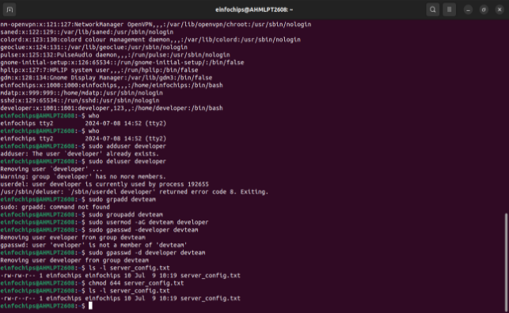

**Part 4: Controlling Services and Daemons 1  Managing Services with systemctl**

Start the Apache service:

sudo systemctl start apache2

￿

Stop the Apache service:

sudo systemctl stop apache2 ￿

Enable the Apache service to start on boot:

sudo systemctl enable apache2

￿

Disable the Apache service:

sudo systemctl disable apache2

￿

Check the status of the Apache service: sudo systemctl status apache2

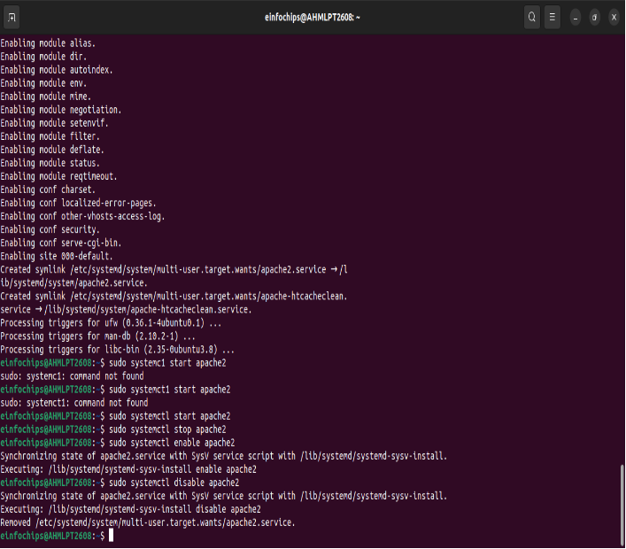

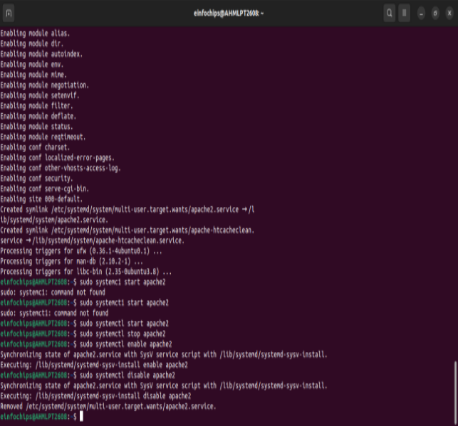

**Part 5: Process Handling Viewing Processes**

List all running processes:

ps aux

￿

Use  top to view processes in real-time: top

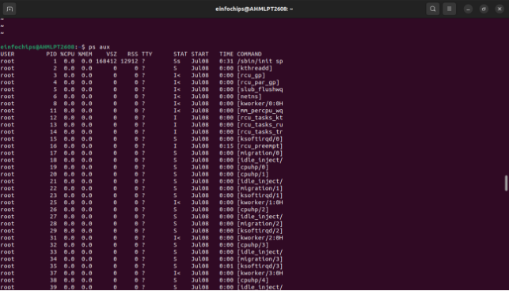

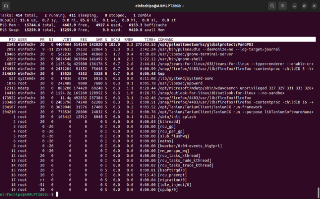

**Creating and Deploying a Static Website with Apache2**

**Part 1: Installing Apache2 (5 minutes)**

1. **Update Package Lists**

Open the terminal and run: sudo apt update

￿

2. **Install Apache2**

Install Apache2 by running: sudo apt install apache2

￿

3. **Start and Enable Apache2**

Start the Apache2 service:

sudo systemctl start apache2 Enable Apache2 to start on boot:

sudo systemctl enable apache2

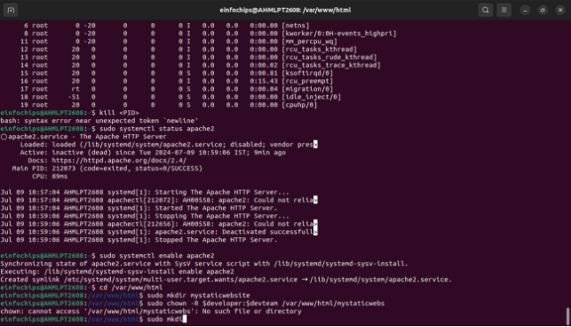

**Part 2: Creating the Website Create HTML File**

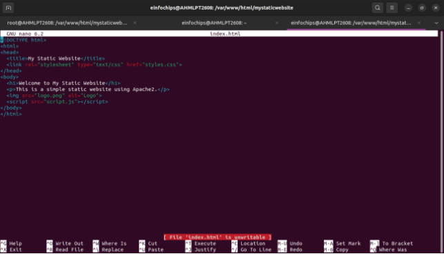

**Create CSS File**

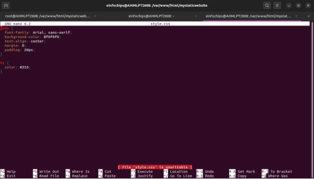

**Create JavaScript File**

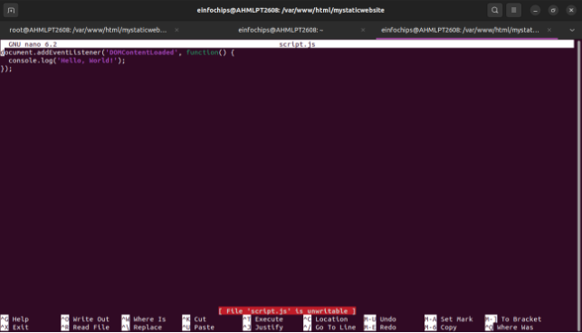

**Part 3: Configuring Apache2 to Serve the Website (10 minutes)**

1. **Create a Virtual Host File**

Create and edit the virtual host configuration file:

sudo nano /etc/apache2/sites-available/mystaticwebsite.conf

￿

Add the following content:

<VirtualHost \*:80>

ServerAdmin webmaster@localhost DocumentRoot /var/www/html/mystaticwebsite ErrorLog ${APACHE\_LOG\_DIR}/error.log

CustomLog ${APACHE\_LOG\_DIR}/access.log combined

</VirtualHost>

￿

- Save and exit (Ctrl+O, Enter, Ctrl+X).
2. **Enable the New Virtual Host**

Enable the virtual host configuration:

sudo a2ensite mystaticwebsite.conf

￿

3. **Disable the Default Site**

Disable the default site configuration: sudo a2dissite 000-default.conf **Reload Apache2**

Reload the Apache2 service to apply the changes: sudo systemctl reload apache2

￿

**2. Test the Configuration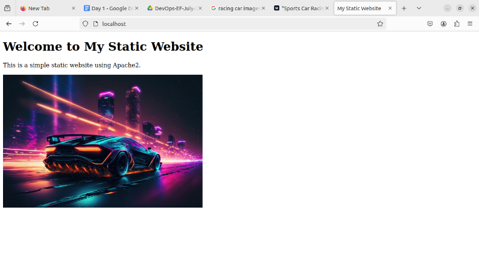**

- Open a web browser and navigate to  http://your\_server\_ip . You should see the static website with the HTML, CSS, JS, and image.
