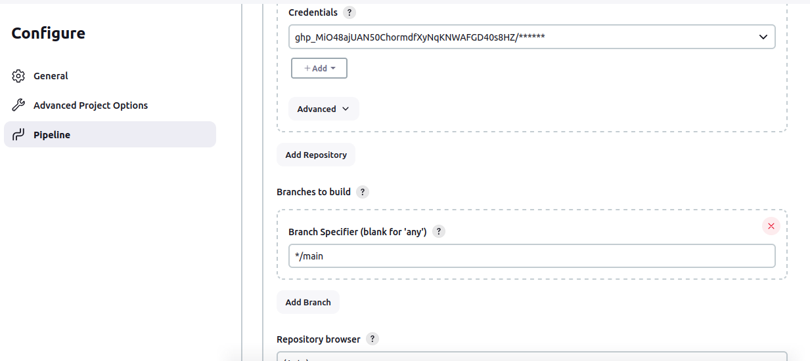

Project Problem Statement

A development team needs to establish a basic CI/CD pipeline for a web application. The goal is to automate version control, containerization, building, testing, and deployment processes.
Deliverables
Git Repository:

    Create a Git repository: Initialize a new repository for the web application.
    Branching Strategy:
        Set up main and develop branches.
        Create a feature branch for a new feature or bug fix.
    Add Configuration Files:
        Create a .gitignore file to exclude files like logs, temporary files, etc.
        Create a README.md file with a project description, setup instructions, and contribution guide

class App{
    public static void main(String args[]){
        System.out.println("Hello wold");
    }
}

Docker Configuration:

    Dockerfile:
        Write a Dockerfile to define how to build the Docker image for the web application.
    Docker Ignore File:
        Create a .dockerignore file to exclude files and directories from the Docker build context.
    Image Management:
        Build a Docker image using the Dockerfile.
        Push the built Docker image to a container registry (e.g., Docker Hub).

 FROM openjdk:11
COPY . /usr/src/myapp
WORKDIR /usr/src/myapp
RUN javac App.java
CMD ["java", "App"]

Ansible Playbook:

    Basic Playbook Creation:
        Develop an Ansible playbook to automate the deployment of the Docker container.
    Playbook Tasks:
        Install Docker on the target server (if Docker is not already installed).
        Pull the Docker image from the container registry.
        Run the Docker container with the required configurations.
    Inventory File:
        Create an inventory file specifying the target server(s) for deployment.
