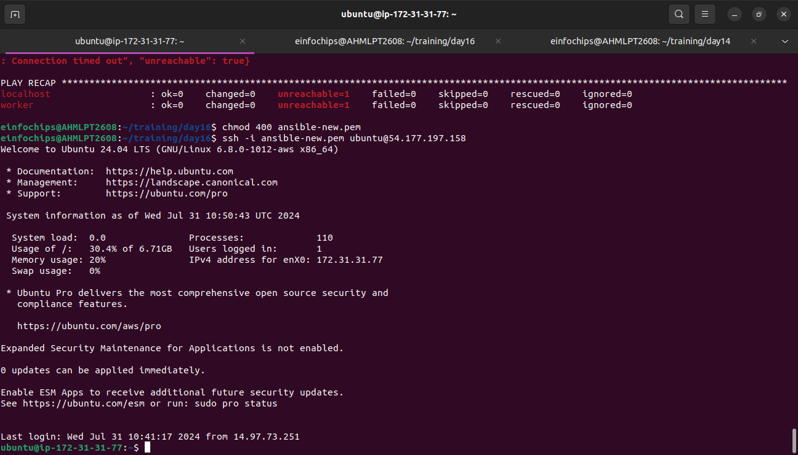
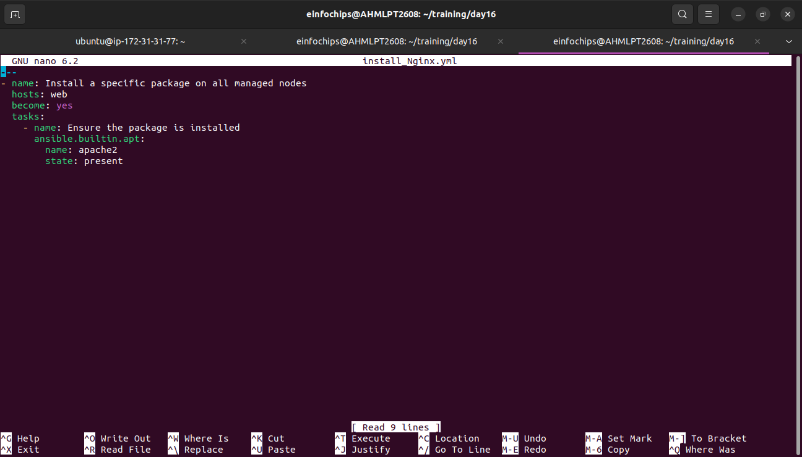
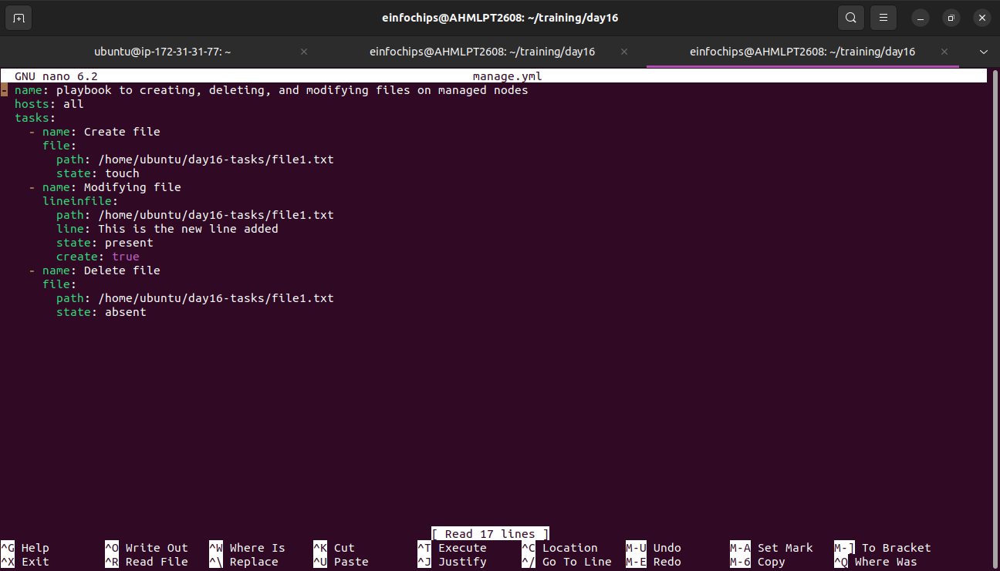

Project 1: Deploying Ansible
Problem Statement: You are tasked with deploying Ansible in a multi-node environment consisting of multiple Linux servers. The goal is to set up Ansible on a control node and configure it to manage several managed nodes. This setup will be used for automating system administration tasks across the network.

Project 2: Ad-Hoc Ansible Commands
Problem Statement: Your organization needs to perform frequent, one-off administrative tasks across a fleet of servers. These tasks include checking disk usage, restarting services, and updating packages. You are required to use Ansible ad-hoc commands to accomplish these tasks efficiently

performed task image1

performed task image2

peerformed task image3

perfoprmed task image4

performed task image5

performed task image6

performed task image7

performed task image8

Project 3: Working with Ansible Inventories

Problem Statement: You need to manage a dynamic and diverse set of servers, which requires an organized and flexible inventory system. The project involves creating static and dynamic inventories in Ansible to categorize servers based on different attributes such as environment (development, staging, production) and roles (web servers, database servers).
Deliverables:
Static Inventory:

    Create a static inventory file with different groups for various environments and roles.

performed task image9

Project 4: Ansible Playbooks: The Basics

Problem Statement: Your team needs to automate repetitive tasks such as installing packages, configuring services, and managing files on multiple servers. The project involves writing basic Ansible playbooks to automate these tasks, ensuring consistency and efficiency in the operations.
Deliverables:
Playbook Creation:
Write a playbook to install a specific package on all managed nod

performed task image1

performed task image2

