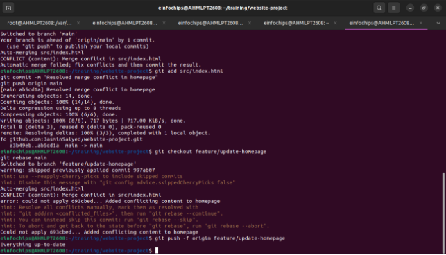

**Git Project** 

**Install Git**:

1 **Set Up Git** : 

2 **Create a GitHub Repository** : 3 **Initialize the Project** :

**Exercise 1: Branching and Basic Operations Create a New Branch** :

**Add a New Page** :

**Exercise 2: Merging and Handling Merge Conflicts Create Another Branch** :

**Update the Homepage** :

**Create a Merge Conflict** : **Merge and Resolve Conflict** :

**Exercise 3: Rebasing**

**Rebase a Branch** :

**Push the Rebased Branch** :

**Exercise 4: Pulling and Collaboration Pull Changes from Remote** : **Simulate a Collaborator's Change** : **Pull Collaborator's Changes** :

**Exercise 5: Versioning and Rollback Tagging a Version** :

**Make a Change that Needs Reversion** : **Revert to a Previous Version** :

![ref1]

**Extra Activities** 

**Stashing Changes** : **Viewing Commit History** : **Cherry-Picking Commits** : **Interactive Rebase** :

![ref1]

**Collaborative Blogging Platform**

**Create a GitHub Repository** : **Initialize the Project** :

**Exercise 1: Branching and Adding Features ( Create a New Branch for Blog Post Feature** : **Add a Blog Post Page** :

**Exercise 2: Collaborating with Merging and Handling Merge Conflicts (25 minutes) Create Another Branch for Author Info** :

**Add Author Info to Blog Page** : **Create a Merge Conflict** : **Merge and Resolve Conflict** :

**Exercise 3: Rebasing and Feature Enhancement Exercise 4: Pulling and Simulating Collaboration Exercise 5: Versioning and Rollback** 

[ref1]: Aspose.Words.95348ad5-24fd-406e-a279-26bb49f8fce8.004.png
