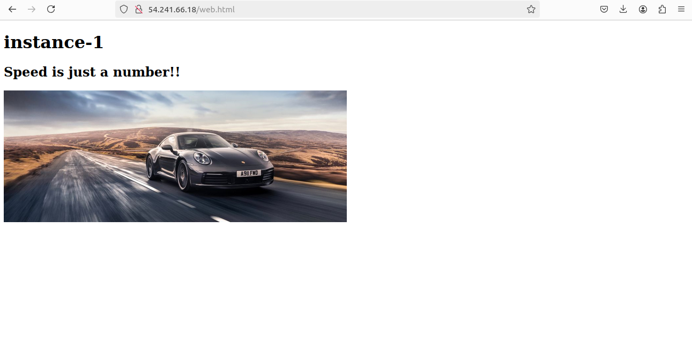

+ Project - 14th August

Deploying a Path-Based Routing Web Application on AWS
- Objective
To evaluate your skills in deploying a web application on AWS using EC2 instances, configuring security groups, and setting up an Application Load Balancer (ALB) with path-based routing. You will deploy two simple web applications, configure the ALB to route traffic based on the URL path, and terminate all resources once the project is complete.
- Project Scenario:
A small company needs to deploy two lightweight web applications, "App1" and "App2," on AWS. The traffic to these applications should be routed through a single Application Load Balancer (ALB) based on the URL path. The company has opted for t2.micro instances for cost efficiency.
Project Steps and Deliverables:
- EC2 Instance Setup (30 minutes):
Launch EC2 Instances:
Launch four EC2 t2.micro instances using the Amazon Linux 2 AMI.
SSH into each instance and deploy a simple web application:
Deploy "App1" on two instances.
Deploy "App2" on the other two instances.
Assign tags to the instances for identification (e.g., "App1-Instance1," "App1-Instance2," "App2-Instance1," "App2-Instance2").
- Launch two instance on EC2
Jasmin-1
Jasmin-2

 - performing following task for both the instances
 sudo apt-get update 
 sudo apt-get install apache2 -y
 sudo mkdir -p /var/www/html/web
 sudo nano /var/www/html/web/index.html

<!DOCTYPE html>
<html lang="en">
<head>
    <meta charset="UTF-8">
    <meta name="viewport" content="width=device-width, initial-scale=1.0">
    <title>Simple HTML Page</title>
</head>
<body>
    <h1>instance-2</h1>
    <h2>Speed is just a number!!</h2>
    
</body>
</html>  
cd /etc/apache2
cd sites-available
ls
sudo cp 000-default.conf web.conf
sudo nano web.conf
add /var/www/html/web -path to the index.html file
sudo a2dissite 000-default.conf
sudo a2ensite web.conf
sudo service apache2 restart
- Security Group Configuration (20 minutes):
Create Security Groups:
Create a security group for the EC2 instances that allows inbound HTTP (port 80) and SSH (port 22) traffic from your IP address.
Create a security group for the ALB that allows inbound traffic on port 80.

Attach the appropriate security groups to the EC2 instances and ALB.

Application Load Balancer Setup with Path-Based Routing (40 minutes):
- Create an Application Load Balancer (ALB):
Set up an ALB in the same VPC and subnets as your EC2 instances.
Configure the ALB with two target groups:
Target Group 1: For "App1" instances.
Target Group 2: For "App2" instances.
Register the appropriate EC2 instances with each target group.

- Configure Path-Based Routing:
Set up path-based routing rules on the ALB:
Route traffic to "App1" instances when the URL path is /app1.
Route traffic to "App2" instances when the URL path is /app2.
Set up health checks for each target group to ensure that the instances are healthy and available.

- Testing and Validation (20 minutes):
Test Path-Based Routing:
Access the ALB's DNS name and validate that requests to /app1 are correctly routed to the "App1" instances and that /app2 requests are routed to the "App2" instances.

