**Docker Project 01**

**Part 1: Creating a Container from a Pulled Image**

**Part 2: Modifying the Container and Creating a New Image**

**Part 3: Creating a Dockerfile to Build and Deploy a Web Application Part 4: Cleaning Up**

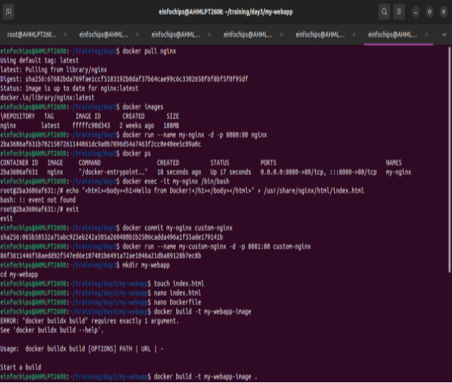

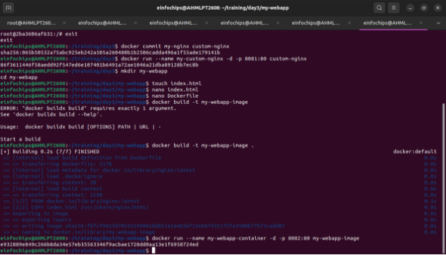

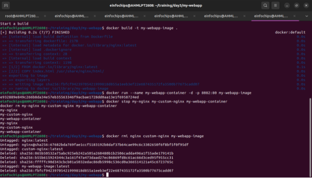

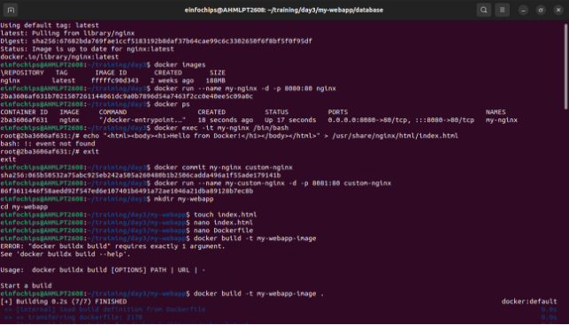

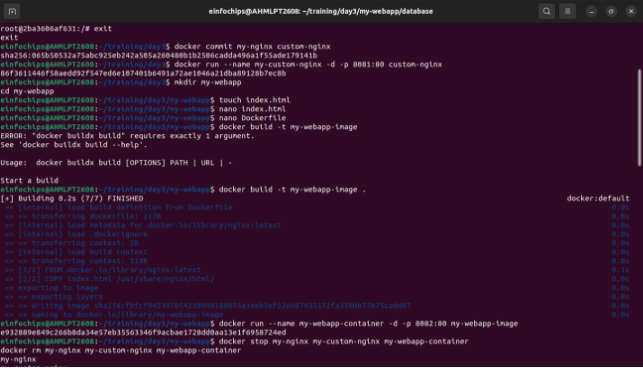

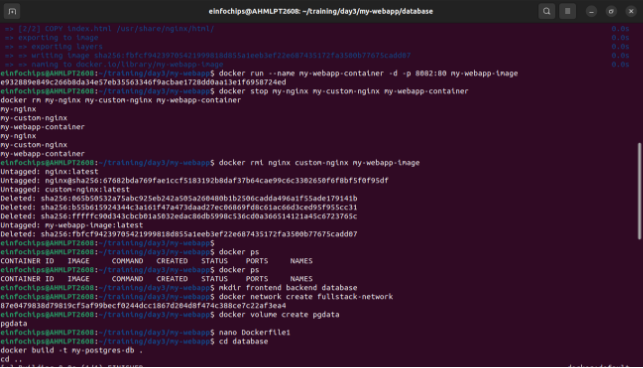

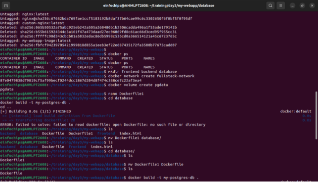

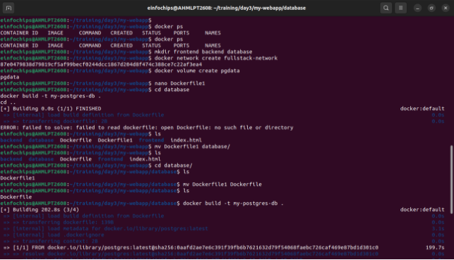

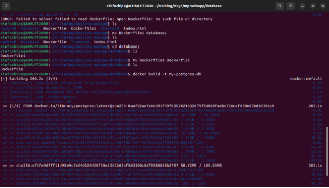

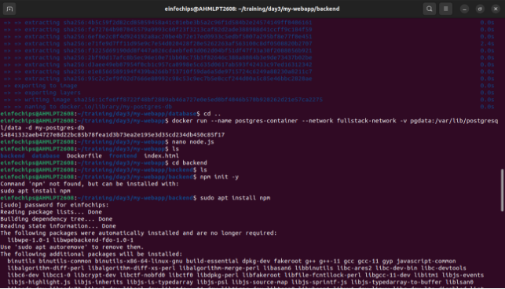

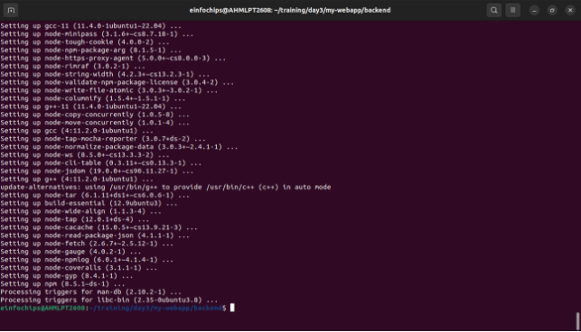

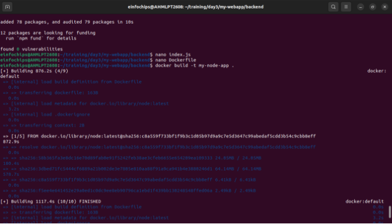

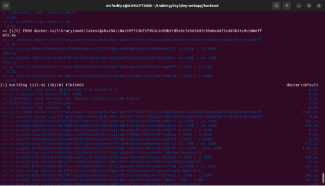

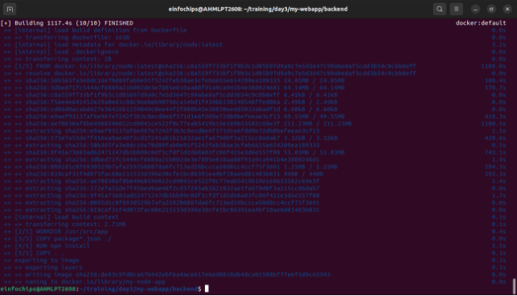

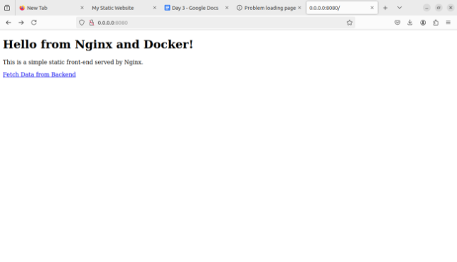

