**Docker Project**

**Part 1: Setting Up the Project Structure**

**Part 2: Setting Up the Database**

**Part 3: Setting Up the Backend**

**Part 4: Setting Up the Frontend** 

**Part 5: Connecting the Backend and Database**

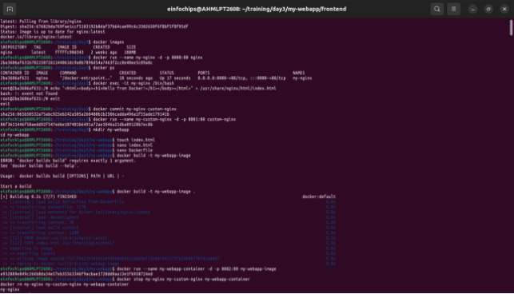

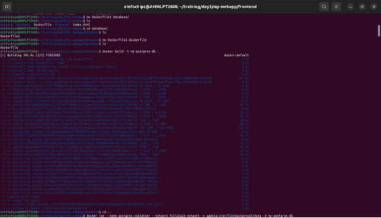

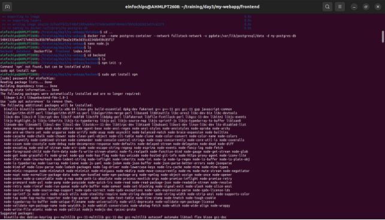

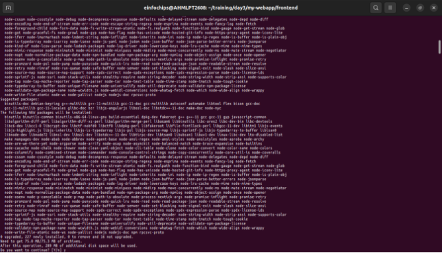

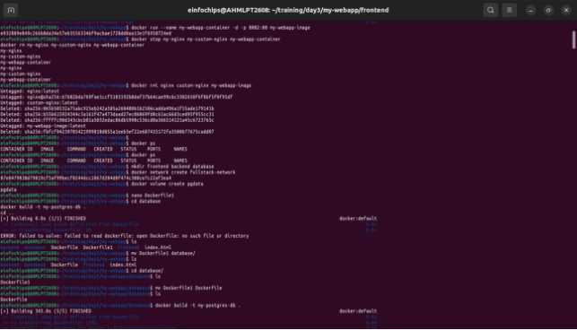

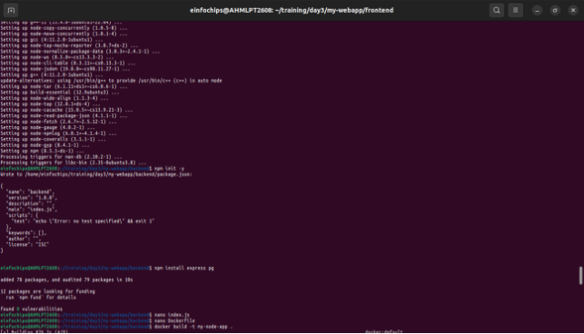

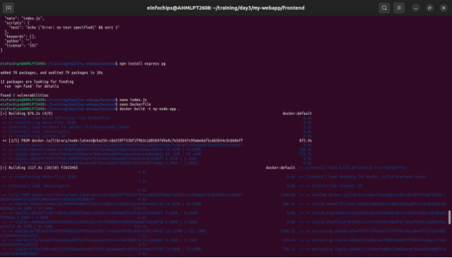

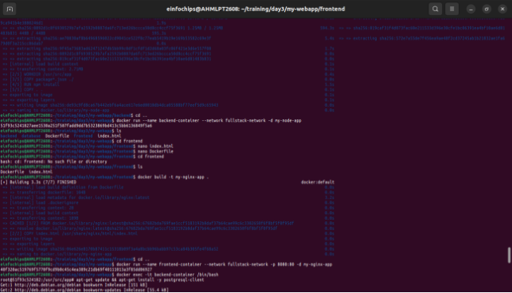

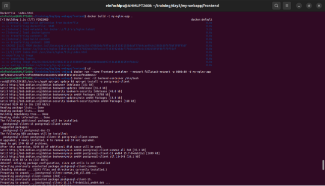

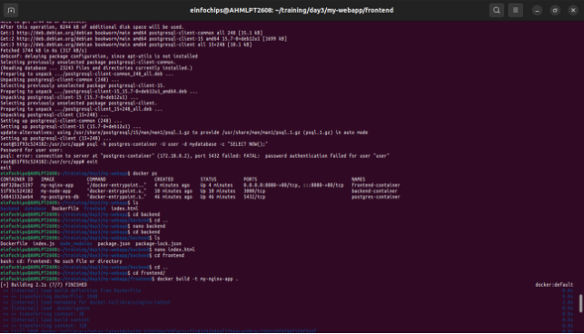

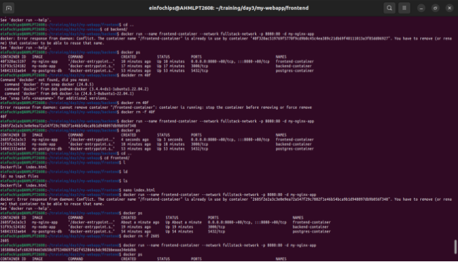

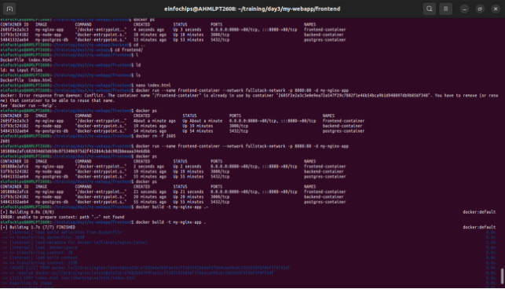

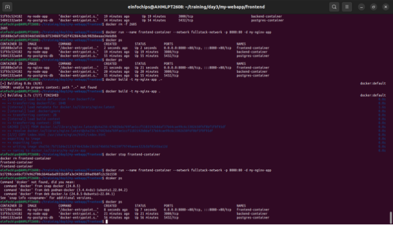

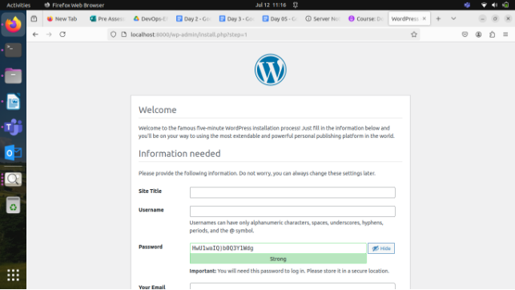
